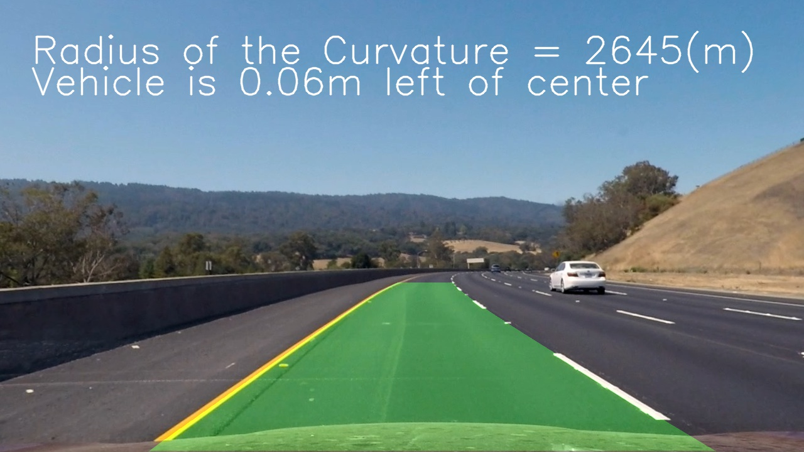
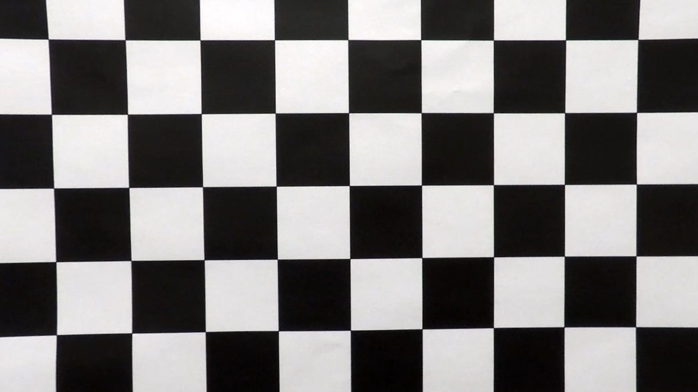
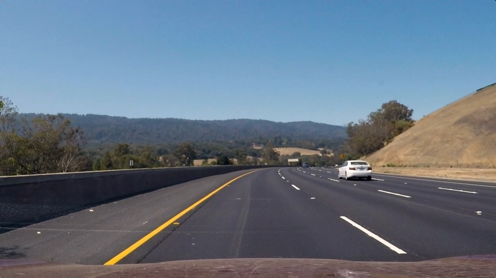
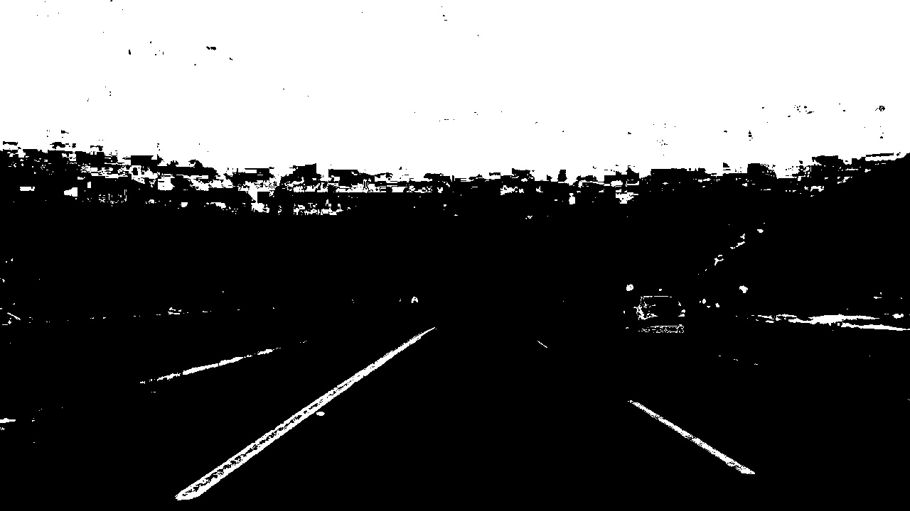
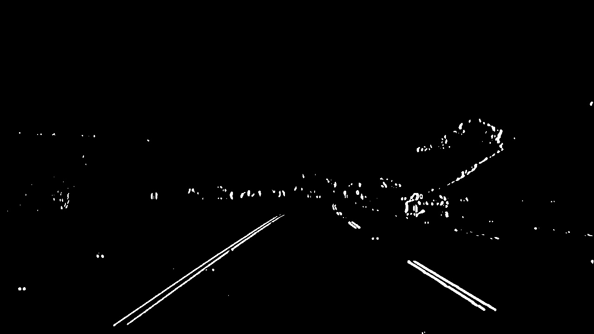
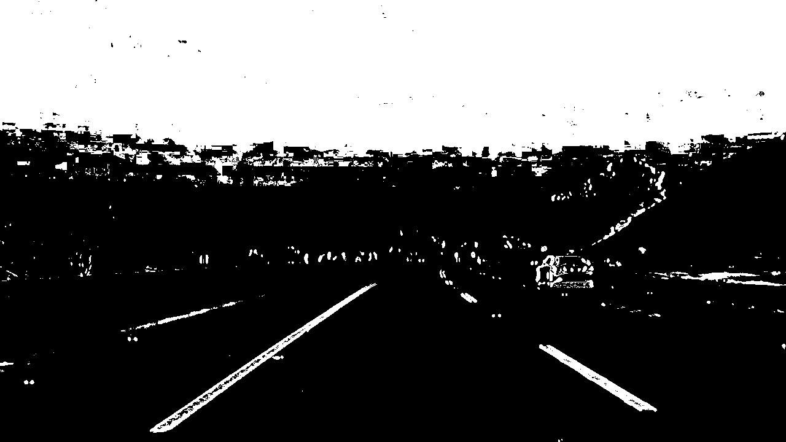
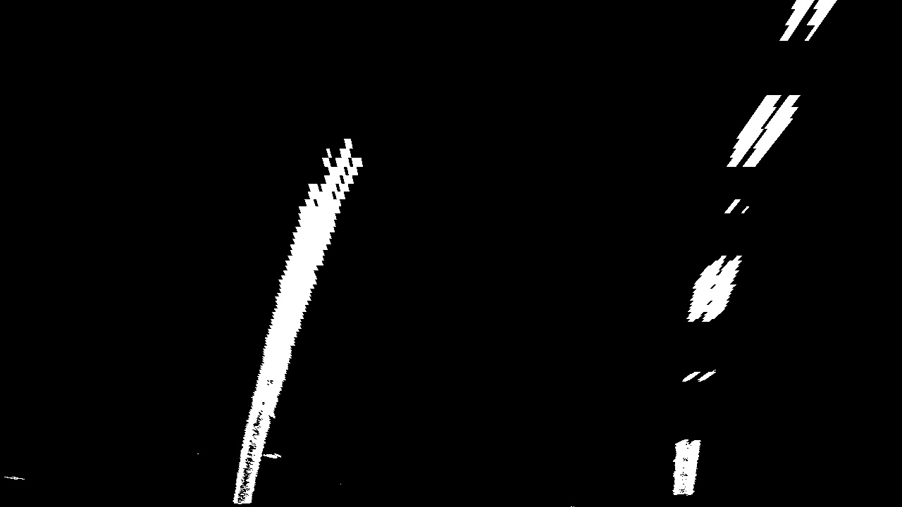

## Advanced Lane Finding

In this project, the idea is to improve the approach in 
[Lane Line Finding](https://github.com/lucascoelhof/CarND-LaneLines-P1) with new techniques learned from
the [Self-Driving car Engineer Nanodegree from Udacity](https://www.udacity.com/course/self-driving-car-engineer-nanodegree--nd013).



You can find a result video [here](https://youtu.be/uV5FKq-Id6s)

# Table of contents
[Camera Calibration](#camera-calibration)
* [Image processing pipeline](#image-processing-pipeline)
    * [Thresholded binary image](#thresholded-binary-image)
    * [Perspective transform](#perspective-transform)
    * [Detecting lane pixels](#detecting-lane-pixels)
    * [Warping to original image](#warping-to-the-original-image)
    * [Parameters](#parameters)
* [Try it yourself](#try-it-yourself)

---
## Camera calibration

The first and very important step in our image processing pipeline is camera calibration.
This is a step sometimes neglected, but very important to have consistent and correct images.
Cameras are made with lenses, and because they do not represent a perfect pinhole model, their lenses
distort the formed image. However, using camera calibration, we can evaluate this distortion and apply
an undistortion to the image.

One of the ways to calibrate a camera is to prepare a chessboard pattern and take multiple pictures of it, in many
different angles and positions. You can find these pictures in folder ```camera_cal```. Then assuming (x,y,z) coordinates
for the chessboard corners and that it is fixed on plane where z=0, we use we use cv2.findChessboardCorners
to find the correspondent corners in the image and cv2.calibrateCamera to match camera 
to find the chessboard pattern in the multiple images provided. With this chessboard pattern detected, we then
use cv2.calibrateCamera to find the camera calibration parameters. For a detailed explanation on how
camera calibration works in Python, please follow [this tutorial](https://opencv-python-tutroals.readthedocs.io/en/latest/py_tutorials/py_calib3d/py_calibration/py_calibration.html).

Generally, you don't have to calibrate your camera all the time. Preferably, you will do it once, then
store the parameters. Given that, I've separated the camera calibration in a separate script. You can run it using

```
python3 camera_calibration.py
``` 
This script will store a ```calibration.p``` file with the calibration parameters.

With the camera calibration parameters on hand, now we should undistort the image. For that, we can
reload the parameters from ```calibration.p```, then use cv2.undistort to get the image.


Distorted image:


Undistorted image:


---

## Image processing pipeline

Now, we will go through each step ran at every frame of the video. We start with this example image:




### Thresholded binary image
After undistorting the image, we then proceed to create a binary thresholded image. In this step, we transform the
video frame into a binary image (either white or black). We do so in order to get an easier to treat image for the following
steps. The first step is to calculate the HSL representation of the image. HSL (hue, saturation and lightness)
is another way to represent color spaces, other than RBG. We use the S channel because it is immune to lightness and color
variations in the image. This is the output of the S channel binary image:



Then, we use the L channel to calculate the [Sobel-Feldman Operator](https://docs.opencv.org/3.0-beta/doc/py_tutorials/py_imgproc/py_gradients/py_gradients.html).
The Sobel operator is a joint of a Gaussian smoothing and a Canny transform of the image.
Differently from Canny transform, the Sobel operator can have a derivative direction, so we can consider derivatives in a specific
orientation. This is the output of the binary Sobel transform on L channel:



Combining both with a AND operator, we get our final thresholded binary image:



Where lanes are more defined on this final image than on each of them separately.

The code can be found on [thresholding.py](src/thresholding.py)


### Perspective transform 

After getting the binary images, we then perform a perspective transform to the image, so we can get a
birds-eye view of the lanes. This will be useful for detecting the lane curvatures on the next step. 
For performing the perspective transform, I assumed that the camera is centered on the vehicle and I
applied a transform which transformed the trapezoid formed by the lanes on the image into destination
points on the transformed image: 

```yaml
trapezoid: [[200, 720], [590, 450], [690, 450], [1130, 720]]
dest_points: [[320, 720], [320, 0], [960, 0], [960, 720]]
``` 
This gives the following result on the binary image:



The code can be found on [perspective.py](src/perspective.py)


### Detecting lane pixels

I used a sliding window technique to find where most pixels on each vertical window is,
and thus, determinate the position of the lane. Then, I fitted these positions to a second-order
polynomial. I also keep the polynomial parameters of the last 30 fitted polynomials
and use the average to display the information to the user. This greatly improved algorithm 
stability and display clarity.

The code can be found on ```src/lane_polyfit.py```

### Warping to the original image 
I created a solid with the polynomial curves of the evaluated parameters 
of the current average of the polynomial parameters. The result looks like this:

 
 
The code can be found on [lane_polyfit.py](src/lane_polyfit.py)

### Parameters

All the parameters of the code are configurable through [config.yaml](config.yaml) file.
I have implemented a python module that takes care of the parameters and reads the
yaml file when user requests for it.


## Try it yourself

First of all, 
please follow the instructions here to set up your conda environment. Then, on your terminal use:
 
```bash
conda activate carnd-term1
```

Then, run the [camera_calibration.py](camera_calibration.py)

```bash
python3 camera_calibration.py
```
It will produce the file [calibration.p](camera_cal/calibration.p).
Then, to get video output, you can run:

```bash
python3 project_video.py
```
 
It will process the video and put it on folder [output_videos](output_videos).

If you want to have the output of each image processing step, you can run:

```bash
python3 test_images_lane_lines.py
```

It will output the images of each step of the pipeline on folder [output_images](output_images).
